# kWhKlar.de — Semantic Internal Link Graph
> Strukturierte Architektur des internen Verlinkungsgraphen für optimale PageRank- und Keyword-Cluster-Verteilung.

```mermaid
graph TD
  Home["🏠 Startseite (/)"] --> CalcHub["⚡ Rechner-Hub (/stromkosten-rechner)"]
  Home --> DeviceHub["🔌 Geräte-Hub (/geraete)"]
  Home --> HouseholdHub["👥 Haushalt-Hub (/stromverbrauch-haushalt)"]
  Home --> PriceHub["💶 Strompreis (/strompreis)"]
  Home --> SaveHub["🌱 Strom sparen (/strom-sparen)"]

  CalcHub --> KwhCalc["kWh Rechner (/kwh-rechner)"]
  CalcHub --> WattCalc["Watt Rechner (/watt-rechner)"]
  CalcHub --> HourCalc["Kosten pro Stunde (/stromkosten-pro-stunde)"]
  CalcHub --> MonthCalc["Kosten pro Monat (/stromkosten-pro-monat)"]

  DeviceHub --> Fridge["Kühlschrank (/geraete/kuehlschrank)"]
  DeviceHub --> Washer["Waschmaschine (/geraete/waschmaschine)"]
  DeviceHub --> Dryer["Trockner (/geraete/trockner)"]
  DeviceHub --> PC["Gaming-PC (/geraete/gaming-pc)"]
  DeviceHub --> AC["Klimaanlage (/geraete/klimaanlage)"]

  HouseholdHub --> Single["1 Person (/stromverbrauch-1-person)"]
  HouseholdHub --> TwoP["2 Personen (/stromverbrauch-2-personen)"]
  HouseholdHub --> FourP["4 Personen (/stromverbrauch-4-personen)"]
  HouseholdHub --> House["Einfamilienhaus (/stromverbrauch-einfamilienhaus)"]

  SaveHub --> Vampires["Stromfresser (/stromfresser)"]
  SaveHub --> Standby["Standby (/standby-strom)"]
  SaveHub --> Solar["Balkonkraftwerk (/balkonkraftwerk/stromkosten-sparen)"]
```

## 1. Verlinkungs-Regeln
1. **Jede Geräteseite** verlinkt zurück zur Kategorie `/geraete`, zum Hauptrechner `/stromkosten-rechner` und zu ähnlichen Haushaltsgeräten.
2. **Jede Haushaltsseite** verlinkt zum Haupt-Haushaltsrechner `/stromverbrauch-haushalt`, zu den weiteren Personenzahlen und zu Stromspartipps.
3. **Jede Rechnerseite** verlinkt bidirektional zu komplementären Rechnern (z.B. Watt-Rechner <-> kWh-Rechner <-> Stundenkosten-Rechner).
4. **Header- und Footer-Navigation** binden alle Haupt-Cluster auf jeder Unterseite ein, wodurch **0 verwaiste Seiten (Orphan Pages)** garantiert sind.

---
Stand: 2026-09-01 | kWhKlar.de
